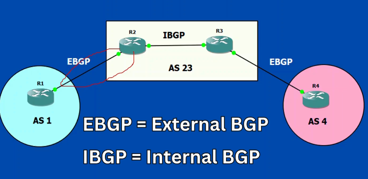

## Qué es
Es un protocolo de enrutamiento entre sistemas autonomos y que en lugar de métricas, hace uso de políticas para la transmisión en lugar de métricas como los protocolos EIGRP, RIP, OSPF.

*Es la base con la cual funciona internet*

> Es un protocolo que conecta punto a punto (Entre routers externos) que usa el puerto TCP 179 para la transmisión de datos

## Características de BGP

BGP es **escalable** puesto que permite manejar miles de rutas (el router debe contar con los recursos de hardware necesarios)
**Estabilidad** y adecuado para la redes complejas como internet
**Flexibilidad** Permite configurar el tráfico en función a prefijos (pref1: salida1, pref2: salida 2)
**Convergencia lenta** a cambio de estabilidad lo que permite tener confiabilidad en las redes
**Soporte CIDR** Permite summarizar direcciones
**Optimización de rutas** solo envia los cambios en las tablas de enrutamiento
**Loop prevention** AS_PATH que previene los bucles

No es de rápida convergencia
Usa TCP en lugar de IP para garantizar la **confiabilidad** entre los datos
Implementa AS_PATH que permite conocer por que direcciones a pasado un paquete

## Por qué usar BGP
Permite configurar multihoming (conexión con más de 1 ISP), permite establecer que prefijos para la conexión con un ISP.
Permite implementar los políticas de enrutamiento ¿?
**Balanceo de carga en conexion multi-homed** permite modificar la ruta que debe seguir un paquete en función a la carga que tenga un ISP
**Trabajo con overlay networks** Implementa MLPS, VPNs, EVPN, VXLAN permitiendo interconectar los CE (Customer Edge) y PE (Provider Edge)  o las redes empresariales (customer) y los ISP (providers) mediante protocolo MPLS o redes virtuales VPNs, 

**Es robusot para la interconexión de AS**

## Sistemas autónomos
Los sistemas autonomos son un conjunto de routers a cargo de una institución (ej. una empresa) 
*Termino asociado a los ISP (Proveedores de servicio Internet)* 

## Sesiones (iBGP, eBGP)

##### eBGP
Se consideran cuando se requiere la comunicación entre routers de diferentes AS 
##### iBGP
Se usa cuando la comunicación se realiza entre routers en el mismo AS
##### Consideraciones
En función a la sesión a usar ciertos parámetros cambian como por ejemplo el next-hop (cambia con eBGP y se mantiene cuando se hace uso de iBGP).
## Atributos

## Multiprotocolo
Permite implementar ipv4 e ipv6
## Averiguar
Cual es la diferencia entre BGP y IBGP 
¿Cuando se hace uso de cada uno?
IGP

¿Cómo se puede agregar un modelo de IA al enrutamiento?