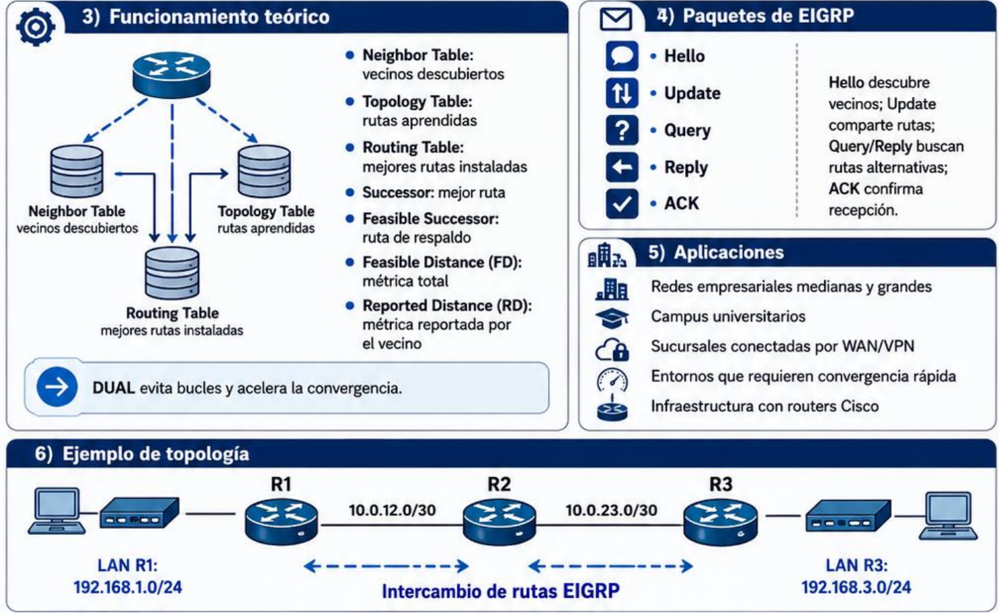
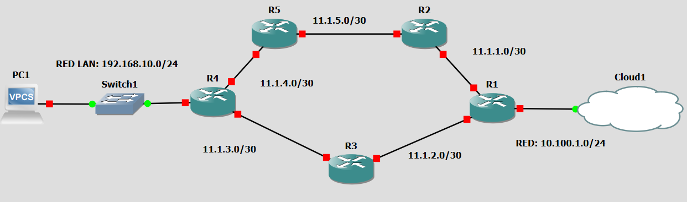

|  |
| :----------------------------------------------: |
| Figura 1: Protocolo EIGRP para routing dinámico  |
### Protocolo EIGRP
Establece la normativa o conjunto de reglas para que la comunicación este protocolo tenga una rápida convergencia de la red (Actualización de las tablas de enrutamiento en un mínimo tiempo), eficiencia energética y de ancho de banda.

*La configuración de este protocolo es similar al establecido al protocolo RIP con la diferencia de que es necesario configurar la wilcard* [ROUTER VOCABULARIO]
## Configuración
|  |
| :-------------------------------------------: |
|        Figura 2: Red de configuración         |
Considerando la red propuesta

