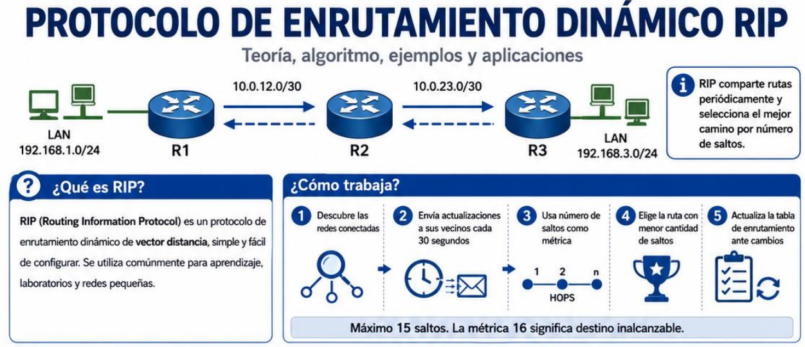

|          |
| :----------------------------------------- |
| **Resumen general sobre el protocolo RIP** |
## RIP v2
Es un protocolo de enrutamiento dinámico interno que se encarga la buscar la ruta más optima en función a la cantidad de nodos en la red.

Para la configuración es necesario conocer la estructura de la red y agregar cada uno de ellas en los routers correspondientes, siendo así que este permite "descubrir" la red de forma "automatica" (es necesaria la configuración de cada Router).

Por ejemplo:

|  |
| :----------------------------------------------------: |
|         **Figura 2: Red de ejemplo protocolo**         |
### Router R1
Por ejemplo en este router tiene configurada 3 redes en sus interfaces de red activas, siendo estas:
* 10.100.1.0/24
* 11.1.1.0/30
* 11.1.2.0/30

Para configurar el protocolo RIP en el router *es necesario agregar cada una de estas redes* en el apartado en los ajustes de su parámetro (network).

## Configuración - Lista de comandos
En el apartado (config) del router se configuran los siguientes comandos:
### router rip
Permite el acceso a la ventana de configuración del protocolo
### version 2
Actualiza la versión de RIP a la 2
### network \[red/network]
Permite agregar una red para que el protocolo tenga conocimiento de su existencia
Ejemplo, para el router R1:
> network 10.100.1.0
> network 11.1.1.0
> network 11.1.2.0

*Se destaca que no es necesario agregar la máscara de red*
### no network \[red/network]
Permite eliminar una red del protocolo de red
Ejemplo
> no network 11.1.1.0
### no router rip
Elimina el protocolo RIP del router en caso este haya sido configurado/habilitado previamente
### no auto-summary
auto-summary (activa por defecto) oculta todas las sub redes de una red
Por ejemplo:
En las subredes de la red 10.0.0.0
> 10.1.5.0
> 10.1.4.0
> 10.1.7.0

Cuando estas se agregan con RIP se sumarizan (resumen) y lo que se ve con el comando **show ip route** es:
> 10.0.0.0

Esto es un problema porque todas las subredes se resumieron en una sola y por ejemplo para llegar (envío de un paquete) hacia la red *10.1.5.0* el protocolo debe recorrer las redes
> 10.1.1.0
> 10.1.2.0
> ....
> 10.1.4.0

**El router no conoce a donde debe ir**, por lo tanto recorre las posibles sub-redes, esto se soluciona con **no auto-summary** permitiendo además que cada red agregada tenga una máscara diferente.
> R1: 10.0.1.0/24  (máscara /24)
> R2: 10.0.2.0/25  (máscara /25)
> R3: 10.0.3.0/26  (máscara /26)

##### El orden si importa
En la configuración del protocolo es necesario desactivar el resumen antes de agregar las redes, si se desactiva despues la red agregada ya se presento en la red de forma sumarizada, el orden correcto de comandos es:
> route rip
> version 2
> no auto-summary
> network \[network]

